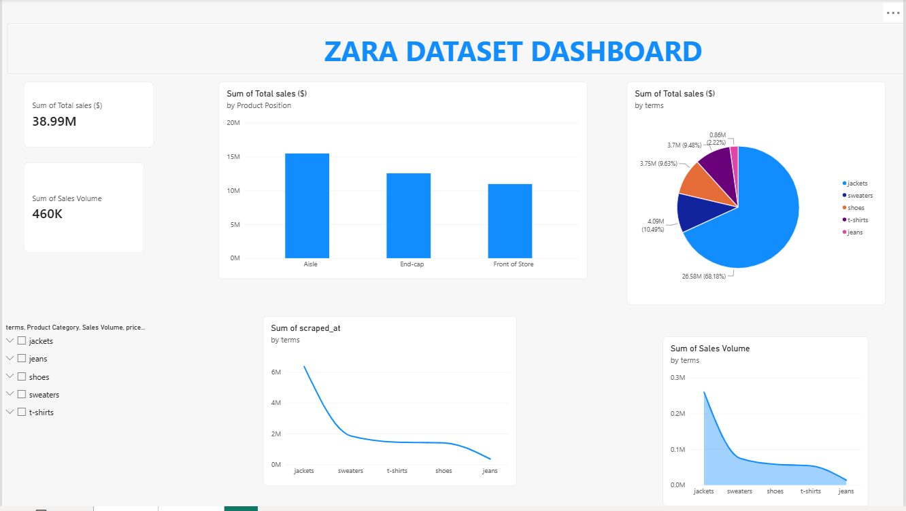

# Data Analytics Portfolio
# Project 1

**Title** [zara](https://github.com/Chiomy12/Chiomy12.github.io/blob/main/Zara%20Power%20BI%20Dashboard%20(1).pbix)

**Project Description** This dataset is a retail sales dataset containing information about the different product, quantity sold and price.  The dataset can be analysed to understand sales trends, top performing products as well as underperforming products. This can be used to make decisions regarding inventory planning and restock level.

**Tools used** Excel(Conditional formating,power query). PowerBi

**key findings** The best performing product term is the JACKET with a total sale of $26581815.87 and total sales volume of 259468. The performance was evaluated based on the total sales volume as well as total sales. The function used to achieve this is the SUMIFS function

**Dashboard Overview** 

